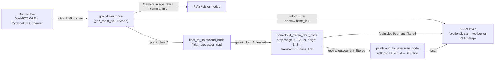
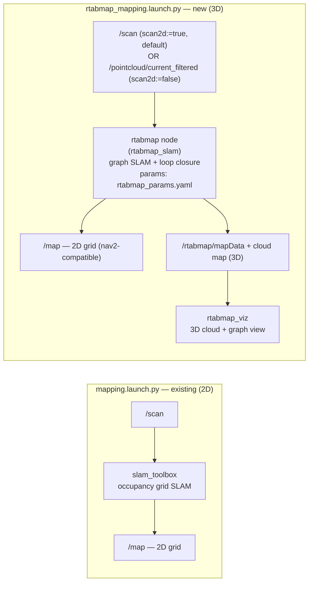
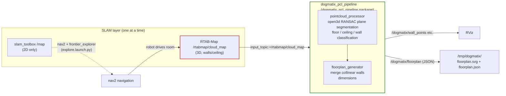
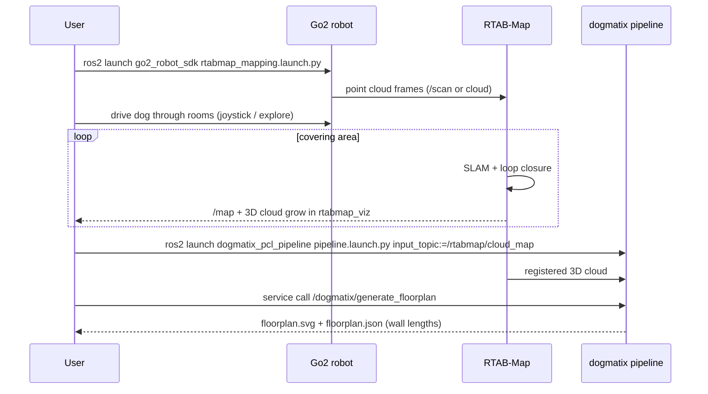

# Dogmatix — Go2 ROS2 Architecture

Mermaid diagrams (render on GitHub, VS Code, or https://mermaid.live).

## 1. Robot data flow

## 2. Two SLAM choices (run ONE launch at a time)

## 3. Dogmatix floorplan pipeline

## 4. Full scan session (goal state)

## Files map

| Layer | Files |
|---|---|
| Driver | `go2_robot_sdk/go2_robot_sdk/presentation/go2_driver_node.py`, `infrastructure/ros2/ros2_publisher.py` |
| Sensor chain (C++) | `lidar_processor_cpp/src/lidar_to_pointcloud_node.cpp`, `pointcloud_frame_filter.cpp` |
| SLAM 2D | `go2_robot_sdk/config/mapper_params_online_async.yaml` (slam_toolbox) |
| SLAM 3D (new) | `go2_robot_sdk/config/rtabmap_params.yaml`, `go2_robot_sdk/launch/rtabmap_mapping.launch.py` |
| Exploration | `frontier_exploration_ros2/` (submodule, C++) — the only active explorer; launched by `go2_robot_sdk/launch/explore.launch.py` |
| Pipeline (new) | `dogmatix_pcl_pipeline/dogmatix_pcl_pipeline/{pointcloud_processor,floorplan_generator,pcl_pipeline_node}.py` |
| Docs | `docs/dogmatix/{project-plan,sensor-research,slam-comparison,rtabmap-integration}.md` |

## Naming notes (frontier)

- `frontier_exploration_ros2/` — upstream C++ explorer, vendored as a git **submodule** (not a fork to edit).
- `frontier_exploration_ros2/plugin/frontier_exploration_ros2_rviz` — RViz control panel that ships *inside the submodule*. Kept because removing it would dirty the submodule; it is not loaded by any config here.
- Standalone Python `frontier_explorer/` and `frontier_explorer_rviz/` packages were earlier duplicates of the submodule stack and have been **removed** — do not re-add.
